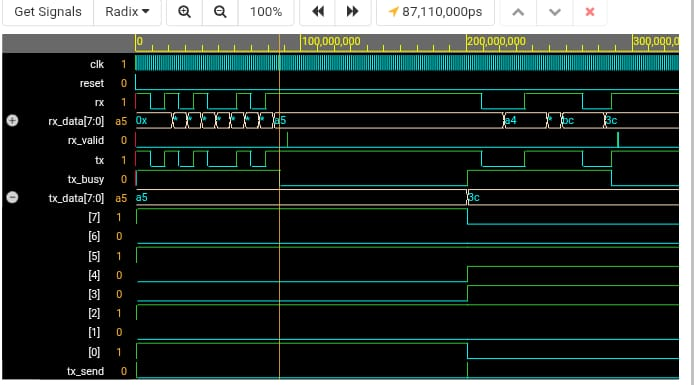

# UART Communication Module

This project implements a UART Transmitter and Receiver in Verilog.

## Features
- Baud Rate: 9600
- Data bits: 8
- Stop bits: 1
- No parity
- Clock: 50MHz

## Folder Structure
.
├── rtl/
│   ├── UART_tx.v      # UART Transmitter Module
│   ├── UART_rx.v      # UART Receiver Module
│   └── UART_TOP.v     # Top Module - TX + RX Loopback
├── sim/
│   └── UART_TB.v      # Testbench for Simulation
├── README.md
└── LICENSE

## Simulation Steps

### Using Icarus Verilog:
```bash
iverilog -o uart_sim sim/uart_tb.v rtl/
uart_tx.v rtl/uart_rx.v rtl/uart_top.v
vvp uart_sim

vlib work
vlog rtl/*.v sim/uart_tb.v
vsim uart_tb
run -all
## Waveform Results



**Observations:**
- Transmitted: `8'hA5` and `8'h3C`
- Received: Same data on `rx_data` ✅
- `rx_valid` pulse confirms data reception
- `tx_busy` goes high during transmission

## Key Features
- UART Tx + Rx with loopback
- 10-bit frame: 1 Start + 8 Data + 1 Stop bit
- Tested with multiple data values

## Tools Used
- EDA Playground
- Icarus Verilog / ModelSim
- Verilog RTL

---
**Day 1 of 100DaysOfRTL Challenge**

